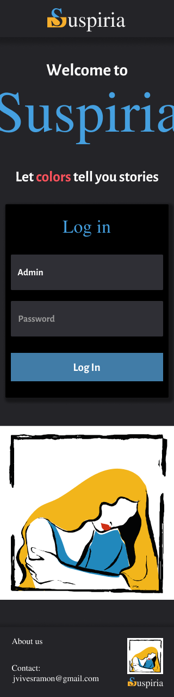
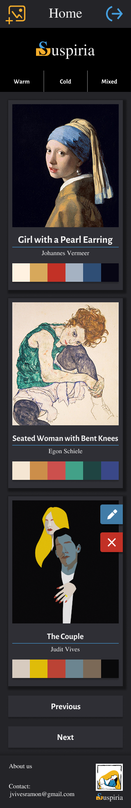
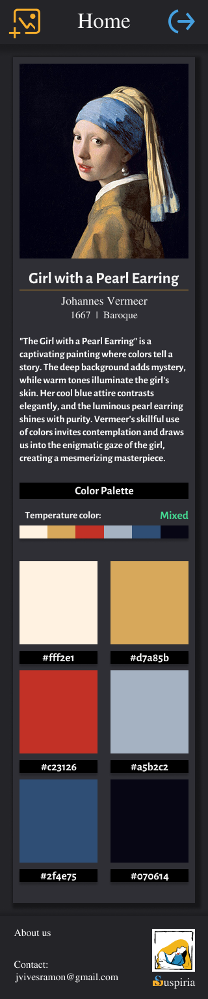
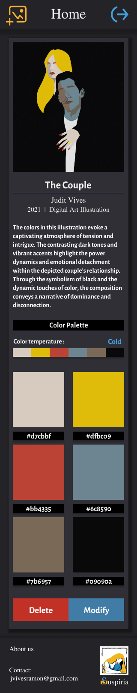

# Suspiria App

This application is developed with React, Vite, and Redux Toolkit. Its main concept is to showcase the main colors of famous paintings to the public. Additionally, users can create, update, and delete cards representing these colors.

## Features

- Display main colors of famous paintings
- Create new pictures cards
- Update existing pictures cards
- Delete pictures cards

## Technologies Used

- React: A JavaScript library for building user interfaces
- Vite: A fast development server and build tool for modern web applications.
- Redux Toolkit: A library for efficient Redux development.
- Styled Components: A CSS-in-JS library to write CSS styles directly in your JavaScript code to style React components.

## Usage

1. You have to log in to access the home page:

- Credentials:
  - Username: admin
  - Password: admin

2. On the home page, you will see a list of color cards representing paintings and their main colors.

3. To create a new color card, click on the "Create" button and fill out the form with the painting details and its main colors.

4. To update an existing color card, click on the "Edit" button on the respective card and make the necessary changes.

5. To delete a color card, click on the "Delete" button on the respective card.

## Getting Started

To run Suspiria App, please follow these steps:

Build the app

```
npm run build
```

Start a development server:

```
npm run dev
```

## Check it out






## Authors

Judit Vives
